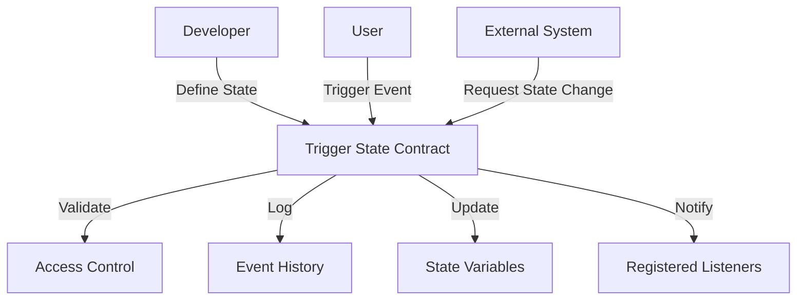

# Trigger State

A flexible, secure state management system for dynamic blockchain interactions.

## Overview

Trigger State provides a robust framework for managing complex state changes and event tracking on the Stacks blockchain. It enables developers to:

- Create flexible, granular state management systems
- Implement dynamic event tracking and state transitions
- Control access and mutations with fine-grained permissions
- Build reactive and responsive decentralized applications
- Ensure data integrity and secure state modifications

## Architecture

The system centers around a core state management contract that enables controlled, auditable state changes.



### Core Components
- State Registry: Manages complex, nested state structures
- Event Tracking: Logs and validates state transitions
- Access Control: Enforces permission-based state mutations
- Listener System: Enables reactive state change notifications

## Contract Documentation

### Trigger State Contract

A comprehensive state management contract with advanced features.

#### Key Features
- Flexible state definition and mutation
- Secure, permission-based state transitions
- Comprehensive event logging
- External system integration
- State change validation

#### Access Control
- Granular permission management
- Role-based state mutation
- Auditable state change history

## Getting Started

### Prerequisites
- Clarinet
- Stacks wallet
- Basic understanding of blockchain state management

### Basic Usage

1. **Define a state variable**
```clarity
(define-state-var my-state {
    status: (string-ascii 20),
    value: uint,
    active: bool
})
```

2. **Update state with permission**
```clarity
(define-public (update-state 
    (new-status (string-ascii 20))
    (new-value uint)
  )
  ;; State update logic
)
```

3. **Register a state change listener**
```clarity
(define-public (register-listener 
    (listener principal)
    (event-type (string-ascii 50))
  )
  ;; Listener registration logic
)
```

## Function Reference

### Public Functions

#### State Management
- `define-state`: Create new state structures
- `update-state`: Modify state variables
- `register-listener`: Add state change observers

#### Permission Control
- `set-role`: Define user roles
- `grant-permission`: Assign state mutation rights
- `revoke-permission`: Remove state mutation access

### Read-Only Functions
- `get-state`: Retrieve current state
- `check-permission`: Validate mutation rights
- `get-event-history`: Access state change logs

## Development

### Testing
1. Clone the repository
2. Install Clarinet
3. Run tests:
```bash
clarinet test
```

### Local Development
1. Start Clarinet console:
```bash
clarinet console
```
2. Deploy and interact with contract

## Security Considerations

### Limitations
- State mutation complexity
- Listener count restrictions
- Computational gas costs

### Best Practices
- Implement strict access controls
- Validate all state transitions
- Use minimal, focused state mutations
- Monitor event logs continuously
- Design resilient error handling